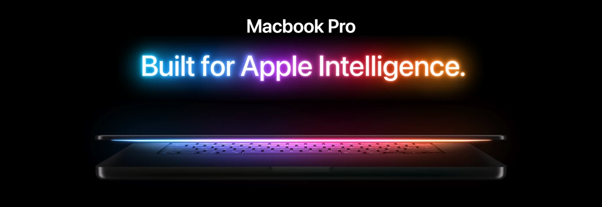

# MacBook Landing Page (clone)



---

↗️ **Demo:** [macbook-clone-landing](https://macbook-clone-landing.vercel.app/) 

---

## 🔍 Overview & Purpose

This project is a frontend recreation inspired by Apple's signature 3D product pages.<br />
Built with **React**, **Three.js**, **GSAP**, and **TailwindCSS**, it puts modern web development techniques into practice to replicate the visual style and interactive feel of Apple's landing pages through **custom code** and original implementation choices.The experience includes:
- **3D Product Scene**: a realistic 3D product scene with dynamic lighting;
- **Scroll‑Driven Animation**: motion tied to scroll position for immersive, interaction‑based behavior;
- **GSAP ScrollTrigger Timelines**: timeline control and advanced scroll‑based transitions;
- **Pinned Sections**: for controlled narrative flow;
- **Image Masking**: for layered visual effects and transitions triggered by scroll;
- **Seamless Timelines**: multi‑section seamless animation sequences;
- **Responsive Design**: adaptive layouts and motion across all breakpoints;
- **Reusable Architecture**: clean component structure supporting maintainability and scalability.

While the landing page draws clear aesthetic inspiration from Apple's approach to product storytelling, it is created solely for educational and portfolio purposes, **not to reproduce or redistribute** Apple's proprietary content.

All code in this repository is written from scratch.

---

## 🛠️ Tech Stack

- [React](https://react.dev/), a component‑based JavaScript library for building dynamic, modular user interfaces;
- [TailwindCSS](https://tailwindcss.com/), a utility‑first framework that enables rapid UI development using composable, low‑level classes;
- [Three.js](https://threejs.org/), a JavaScript 3D library for rendering interactive WebGL scenes, models, and visual effects directly in the browser;
- [GSAP](https://gsap.com/), a high‑performance animation library for creating smooth, scroll‑driven interactions and timeline‑based effects;
- [Vite](https://vitejs.dev/), a fast, modern build tool that provides instant dev‑server startup, smooth HMR, and optimized production builds.

---


## 📁 Project Structure
<!-- TREE_START -->
```
├─ package.json
└─ src
   ├─ App.jsx
   ├─ components
   │  ├─ Features.jsx
   │  ├─ Footer.jsx
   │  ├─ Hero.jsx
   │  ├─ Highlights.jsx
   │  ├─ models
   │  │  ├─ Macbook-14.jsx
   │  │  ├─ Macbook-16.jsx
   │  │  └─ Macbook.jsx
   │  ├─ NavBar.jsx
   │  ├─ Performance.jsx
   │  ├─ ProductViewer.jsx
   │  ├─ Showcase.jsx
   │  └─ three
   │     ├─ ModelSwitcher.jsx
   │     └─ StudioLights.jsx
   ├─ constants
   │  └─ index.js
   ├─ index.css
   ├─ main.jsx
   └─ store
      └─ index.js
```
<!-- TREE_END -->

---

## 📦 Installation

Ensure you have the following installed on your machine:
- [Git](https://git-scm.com/);
- [Node.js](https://nodejs.org/en);
- [npm](https://www.npmjs.com/) (Node Package Manager).

Then clone the repository: 
```bash
git clone https://github.com/t-Federer/apple_macbook_clone00.git
```
And install the project dependencies:
```bash
cd apple_macbook_clone00
npm install
npm run dev
```
Finally, open http://localhost:5173 in your browser to view the project.

## ⚠️ Important Notice (Copyright & Assets)

This is a **non-commercial educational project**.

Any Apple trademarks, product names, or visual references remain the property of their respective owners. If you clone or fork this project, please **respect** Apple's intellectual property.

---

## ⚖️ License

This project is released under the **MIT License**.  
You are free to study, modify, and reuse the code, but **you must provide your own assets** and comply with all relevant copyright laws.
